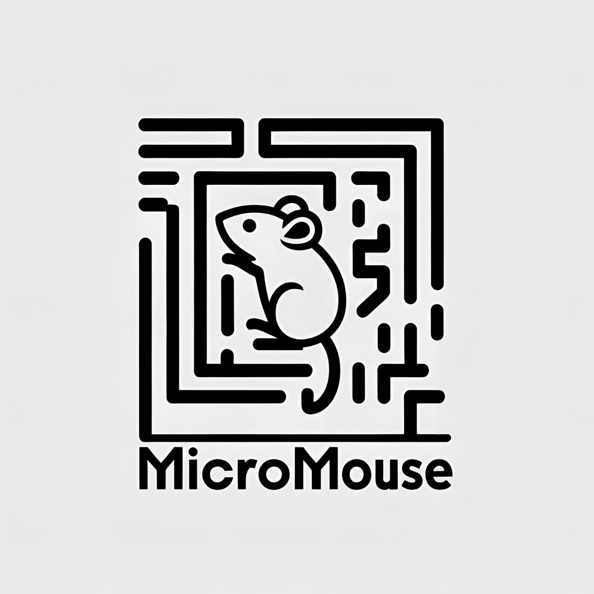
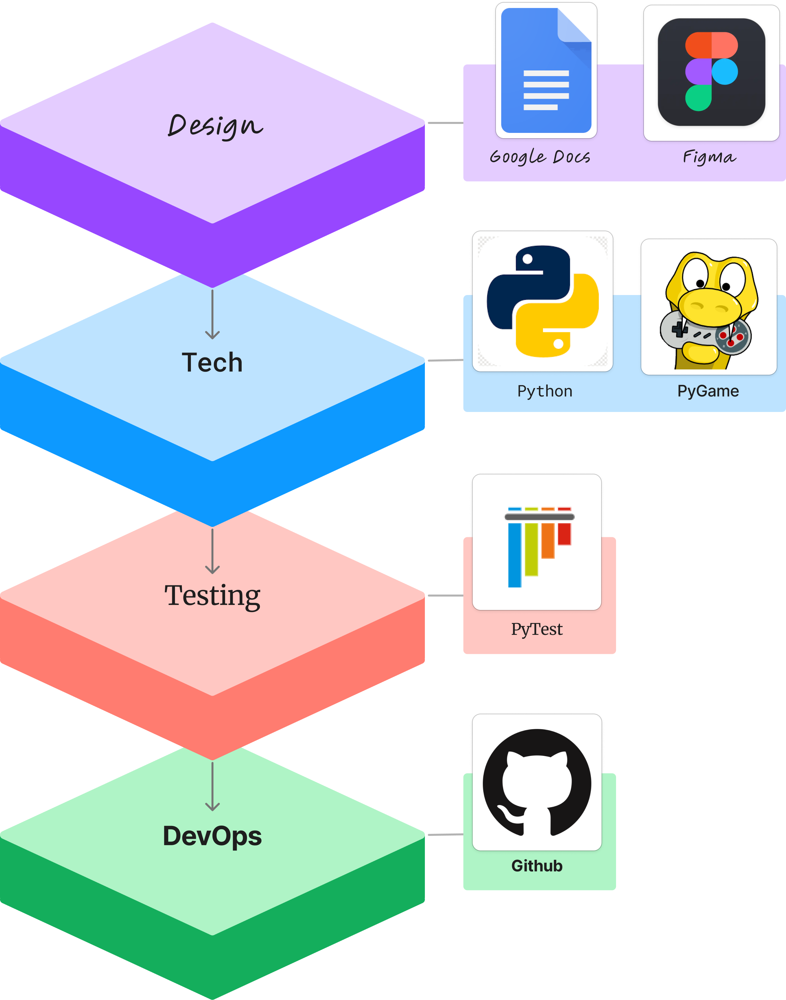

<!-- PROJECT LOGO -->
<br />
<div align="center">

  <a href="https://github.com/<your_repo>">
    
  </a>

  <h3 align="center">
    A small application to play Sudoku!
  </h3>
</div>

<!-- TABLE OF CONTENTS -->

### Table of Contents
<ol>
  <li><a href="#about-the-project">About The Project</a></li>
  <li><a href="#getting-started">Getting Started</a></li>
  <li><a href="#built-with">Built With</a></li>
  <li><a href="#acknowledgments">Acknowledgments</a></li>
</ol>


<!-- ABOUT THE PROJECT -->
## About The Project
<div align="center">
  
</div>

This project serves as the capstone for University of Florida's Data Structures and Algorithms class (COP3530).

In this project we worked in teams of 3 students to create a project pitch to compare two algorithms on a data set of over 100,000 items. Our group elected to create a software that would compare two micromouse algorithms "Flood Fill" and "Wall Follow" 

<!-- GETTING STARTED -->
## Getting Started

### Installation

To try our app you will need the following.
* python '13.12.3'

1. Fork -or- clone the repo to your local machine
2. Navigate to the project file `DSAProject3`
2. Install requirements
   ```sh
   $ python3 -m pip install --upgrade pip
   $ pip install -r requirements.txt
   ```

### Usage

Once you have completed the steps in installation, run the file `src/main.py` and enjoy! 


<!-- BUILT WITH -->
## Built With

This project was built with Python 13.12 and PyGame. Other libraries include:

- PyTest
- Factory-Boy
- Faker

<br />
<div align="center">

</div >

<!-- ACKNOWLEDGMENTS -->
## Acknowledgments

TBD

<!-- MARKDOWN LINKS & IMAGES -->
<!-- https://www.markdownguide.org/basic-syntax/#reference-style-links -->

<!-- Contributors Shield -->
[contributors-shield]: https://img.shields.io/github/contributors/josephhilby/cop3502_final_project.svg
[contributors-url]: https://github.com/josephhilby/cop3502_final_project/graphs/contributors

<!-- Tests Shield -->
[test-shield]: https://github.com/josephhilby/cop3502_final_project/actions/workflows/pytest_ci_testing.yml/badge.svg
[test-url]: https://github.com/josephhilby/cop3502_final_project/actions/workflows/pytest_ci_testing.yml
